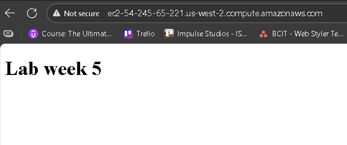

# wk5-Packer-intro-lab-start

Starter files for the week 5 lab, intro to Packer.
See lab instructions on D2L for details.
````markdown
# Packer Web Front Lab

This project builds a custom **Debian 13 AMI** with **Nginx** installed and configured to serve a static HTML page.  
It uses **HashiCorp Packer** with the `amazon-ebs` builder.

---

## Features
- Base Image: Debian 13
- Installed Packages: `nginx`
- Custom Files:
  - `index.html` (served from `/web/html`)
  - `nginx.conf` (placed in `/etc/nginx/sites-enabled/`)
- Nginx enabled to start on boot and serve the included HTML page.

---

## Steps to Build

1. Clone this repository:
   ```bash
   git clone <repo url>
   cd wk5-packer-intro-lab-start
````

2. Initialize Packer plugins:

   ```bash
   packer init .
   ```

3. Validate the template:

   ```bash
   packer validate web-front.pkr.hcl
   ```

4. Build the image:

   ```bash
   packer build web-front.pkr.hcl
   ```

5. The output will give you an AMI ID (e.g., `ami-03f9e4d8aeee62d9d`).

---

## Launching the AMI

1. Go to **AWS EC2 → AMIs** in your AWS Console (Region: `us-west-2`).
2. Select your AMI and launch an instance:

   * Instance type: `t2.micro`
   * Security group: open ports **22 (SSH)** and **80 (HTTP)**
3. Get the public IP of your instance.
4. Visit in browser:

   ```
   http://IP
   ```

---

## Demo Screenshot

Below is the static HTML page served from the AMI:




